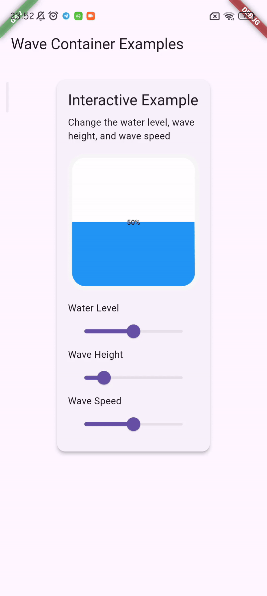

# Wave Container

A highly customizable Flutter widget for creating beautiful wave animations with various effects.

[//]: # ([![pub package]&#40;https://img.shields.io/pub/v/wave_container.svg&#41;]&#40;https://pub.dev/packages/wave_container&#41;)

[//]: # ([![license]&#40;https://img.shields.io/badge/license-MIT-blue.svg&#41;]&#40;https://opensource.org/licenses/MIT&#41;)

## Features

- 🌊 Smooth wave animations
- 🎨 Multiple coloring options (solid, gradient, shimmer)
- 📐 Various wave patterns (sine, square, triangle, etc.)
- ⚡ Interactive animations
- 🎯 Customizable properties
- 📱 Responsive design
- ✨ Easy to use

## Installation

Add this to your `pubspec.yaml`:

```yaml
dependencies:
  wave_container: ^1.0.0
```

## Usage

## Demo

### Interactive Wave




### Basic Usage

```dart
import 'package:wave_container/wave_container.dart';

// WaveContainer(
//   height: 200,
//   waterPercentage: 0.7,
//   solidColor: Colors.blue,
// )
```

### With Gradient Colors

```dart
// WaveContainer(
//   height: 200,
//   waterPercentage: 0.7,
//   waveColorType: WaveColorType.gradient,
//   gradientColors: [
//     Colors.purple,
//     Colors.blue,
//     Colors.cyan,
//   ],
//   gradientStops: [0.0, 0.5, 1.0],
//   gradientType: GradientType.diagonal,
// )
```

### With Shimmer Effect

```dart
// WaveContainer(
//   height: 200,
//   waterPercentage: 0.7,
//   waveColorType: WaveColorType.shimmer,
//   shimmerBaseColor: Colors.blue,
//   shimmerHighlightColor: Colors.lightBlue,
//   shimmerSpeed: 1.5,
// )
```

### Different Wave Patterns

```dart
// WaveContainer(
//   height: 200,
//   waterPercentage: 0.7,
//   waveShape: WaveShape.triangle,
//   waveFrequency: 6.0,
//   waveHeight: 0.3,
// )
```

### Custom Wave Pattern

```dart
// WaveContainer(
//   height: 200,
//   waterPercentage: 0.7,
//   waveShape: WaveShape.custom,
//   customWaveFunction: (x) => sin(x) * cos(x/2),
// )
```

## Properties

### Required Properties

| Property          | Type     | Description                   |
|-------------------|----------|-------------------------------|
| `height`          | `double` | Total height of the container |
| `waterPercentage` | `double` | Fill level (0.0 to 1.0)       |

### Optional Properties

| Property          | Type            | Default               | Description                       |
|-------------------|-----------------|-----------------------|-----------------------------------|
| `backgroundColor` | `Color`         | `Colors.white`        | Container background color        |
| `solidColor`      | `Color`         | `Colors.blue`         | Wave color when using solid color |
| `waveColorType`   | `WaveColorType` | `WaveColorType.solid` | Type of coloring effect           |
| `waveShape`       | `WaveShape`     | `WaveShape.sine`      | Wave pattern type                 |
| `waveHeight`      | `double`        | `0.2`                 | Height of wave peaks (0.0 to 1.0) |
| `waveFrequency`   | `double`        | `4.0`                 | Number of wave cycles             |
| `waveSpeed`       | `double`        | `1.0`                 | Wave animation speed              |

## Wave Types

The widget supports different types of waves through the `waveShape` property:

- `sine` - Smooth sine wave (default)
- `square` - Rectangular wave
- `triangle` - Angular wave
- `sawtooth` - Sharp rise and fall
- `ladder` - Step pattern
- `random` - Random heights
- `custom` - User-defined pattern

## Coloring Options

### Solid Color

Simple single color wave.

### Gradient

Smooth transition between multiple colors with options for:

- Vertical gradient
- Horizontal gradient
- Diagonal gradient

### Shimmer

Animated shimmering effect with customizable:

- Base color
- Highlight color
- Animation speed

## Examples

Check out the [example](example) folder for complete sample app showcasing all features.

<details>
<summary>View Examples</summary>

### Basic Example

[View Code](example/lib/screens/examples/basic_example.dart)

### Gradient Example

[View Code](example/lib/screens/examples/gradient_example.dart)

### Shimmer Example

[View Code](example/lib/screens/examples/shimmer_example.dart)

### Wave Shapes Example

[View Code](example/lib/screens/examples/wave_shapes_example.dart)

### Interactive Example

[View Code](example/lib/screens/examples/interactive_example.dart)

</details>

## Performance Optimization

For optimal performance:

- Use simpler wave shapes (sine, triangle) when possible
- Avoid excessive wave frequency values
- Use solid colors instead of gradients/shimmer for better performance
- Consider device capabilities when customizing animation speeds

1. Fork the repo
2. Create your feature branch:
   ```bash
   git checkout -b feature/my-new-feature
   ```
3. Commit your changes:
   ```bash
   git commit -m 'Add some feature'
   ```
4. Push to the branch:
   ```bash
   git push origin feature/my-new-feature
   ```
5. Submit a pull request

## License

This project is licensed under the MIT License - see the [LICENSE](LICENSE) file for details.

## Support

- 🐛 Report bugs by filing [GitHub Issues](https://github.com/Manh-Dung/wave_container/issues)
- 💡 Feature requests are welcome
- 📫 For questions, reach out to [manhdung5a@gmail.com](mailto:manhdung5a@gmail.com)

---

Made with ❤️ by [DungNm]